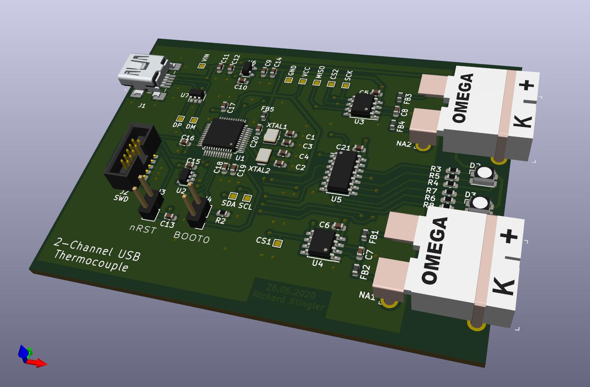

# 2-channel USB thermocouple sensor

### Introduction

This is my first ever published project on Github, so most probably not error free (o;

It is a small 60mm x 80mm USB device which reads out temperatures from two K-type thermocouple sensors via a MAX31855 ADC.
As the main controller a STM32F070CBT6 was chosen due to the simplicity in setting up the STM32CubeIDE and configure it for USB CDC mode.

[**STM32CubeIDE!**](https://www.st.com/en/development-tools/stm32cubeide.html)

For schematic and PCB design the great KiCAD software was used:

[**KiCAD**](https://kicad-pcb.org/)

### Functions

After powering up (the device gets its power from the USB port) the internal RTC is not set (no battery backup)
and therefore starts sending out the measured temperatures through its USB device port as comma separated values:

    24.50,24.50
    24.50,24.75
    25.00,24.50

### USB Interface

In STM32CubeIDE the USB CDC profile was chosen for its simplicity, which makes it possible to use any terminal program as the device registers to a PC host as a serial interface, for example /dev/ttyACM0 in case of Linux.

### Error

If a thermocouple error occurs in case of a short-cut or not being plugged in, the according channel doesn't output any values anymore.
This makes sense when for example only one channel is used. Only when all channels show an error, the information is output via USB as well.

### USB Commands

The device not only sends the values out the USB interface but can also receive simple commands like setting the clock and interval of measurements.

#### Setting the RTC time

The internal RTC clocks time can be set with following string sent to the USB port:

    T103055<Return>
    
    T:        Determines the command type -> Set time
    10:       The first two digits are the hour in 24h format including leading zero
    30:       followed by two digits minutes with leading zero
    55:       and finally two digits seconds, again with leading zeroes
    <Return>: End of command is determined by a return, or 0x0A in Hex

Under Linux it is pretty easy to set the time in a terminal window like:

    echo "T095011" > /dev/ttyACM0

As soon a valid RTC time is set, the CSV output contains the time in the first column:

    09:36:21,24.50,24.75
    09:36:22,24.25,24.75
    09:36:23,24.50,24.75

#### Set date

When logging temperatures for a longer time it makes sense to include the date as well. The date can be set similar to the time command:

    D200611<Return>

    D:        Command type, D = set date
    20:       Year in two digits format
    06:       Month with two digits and leading zero
    11:       Day in two digits, again with leading zeroes
    <Return>: End of command (Hex 0x0A)

As soon as a date is set, the date is prepended to the CSV output, but is not separated:

    11.06.2020 09:49:29,24.50,24.75
    11.06.2020 09:49:30,24.50,24.75
    11.06.2020 09:49:31,24.50,24.75

#### Change measurement interval

The measurement interval is set to 1 second by default, but for longer measurement periods and to keep the data small, an interval can be set for example to measure every 5 minutes:

    I300<Return>

    I:        Command type, I = set interval
    300:      Time in seconds
    <Return>: End of command (Hex 0x0A)

This command might be changed or a new command might be possible to trigger measurements not by interval but by RTC time, for example when someone wants to measure it every hour it makes sense that the measurement is done when the time is exactly 12:00. With the interval setting the measurement cycle starts as soon the command is recognized, regardless of the current time.

#### Temperature offset

This command is currently being worked on and so far the tests are good.
The offset values are also stored in EEPROM.

    O1:-2.5<Return>

    O:        O = Offset command
    1:        Channel number, starting with 1 followed by :
    -2.5:     Offset value in degrees Celsius
    <Return>: End of command (Hex 0x0A)

#### DFU Bootloader Mode

The device can be set into DFU bootloader mode just by sending a predefined command. The code is tested that it successfully enters DFU mode when the command is sent via USB.

This puts the controller into DFU USB bootloader mode:

    echo "X1704" > /dev/ttyACM1

Afterwards a new firmware can be flashed with dfu-util:

    dfu-util -a 0 -s 0x08000000:leave -D ./USB_Thermologger_2/Debug/USB_Thermologger_2.bin

### Donations

All my projects (currently not much but growing ;o) are self financed. If you like you can make a donation to my Paypal.me link:

paypal.me/renderingfun
[**Paypal Me Link**](https://paypal.me/renderingfun)
