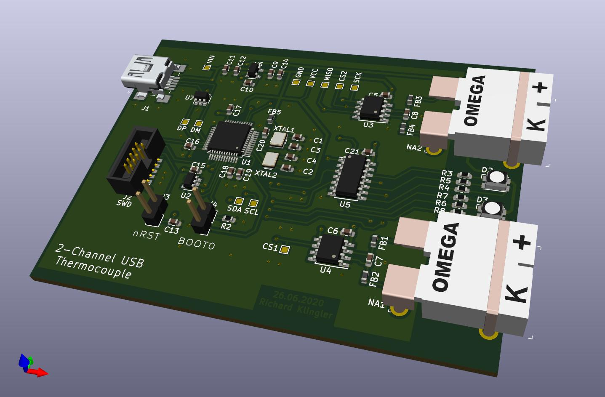

# 2-channel USB thermocouple sensor



### Introduction

This is my first ever published project on Github, so most probably not error free (o;

It is a small 60mm x 80mm USB device which reads out temperatures from two K-type thermocouple sensors via MAX31855 converters.
As the main controller a STM32F070CBT6 was chosen due to the simplicity in setting up the STM32CubeIDE and configure it for USB CDC mode.

[**STM32CubeIDE**](https://www.st.com/en/development-tools/stm32cubeide.html)

For schematic and PCB design the great KiCAD software was used:

[**KiCAD**](https://www.kicad.org/)

### Repository layout

| Folder | Content |
|---|---|
| `kicad/usb_thermo_logger` | Schematic, PCB layout, 3D preview, datasheets |
| `openscad` | Front and back panels for the enclosure (`.scad` and `.stl`) |
| `stm32/USB_Thermologger_2` | Firmware, STM32CubeIDE project |
| `python` | PyQt5 logger application for the **previous** firmware (see below) |

### How it works

The device is powered from the USB port and registers as a USB CDC serial interface, so no driver is needed:

| OS | Device |
|---|---|
| Linux | `/dev/ttyACM0` |
| macOS | `/dev/cu.usbmodem…` |
| Windows | `COMx` |

The baud rate setting doesn't matter.

| USB descriptor | Value |
|---|---|
| Vendor ID / Product ID | `0x1209` / `0x5304` ([pid.codes](https://pid.codes/1209/5304/)) |
| Manufacturer | Klingler Engineering |
| Product | USB Thermocouple Logger |
| Serial number | Unique per device, derived from the STM32 chip ID |

The device doesn't send anything on its own. The host software asks for a measurement whenever it wants one, and adds its own timestamps.
This keeps the firmware simple: no clock to set, no drift, and the polling interval is completely up to the host.

The MAX31855 converts about 10 times per second, so polling faster than every 100 ms just returns the same value again.

### USB commands

| Command | Reply | Function |
|---|---|---|
| `?` | `24.50,23.75` | Read all channels |
| `*IDN?` | `Klingler Engineering,TC2,208438763130,1.0.0` | Identify the device |
| `C?` | `2` | Number of channels |
| `X1704` | none | Enter the DFU bootloader (see [Firmware update](#firmware-update)) |

Every reply is one line terminated by CR LF (`\r\n`).

Commands don't need a line ending, but **each command has to arrive in one piece**. The firmware looks at every USB packet on its own, so send the whole command with a single write.
A terminal program like `screen` sends every keystroke separately, which only works for the single-character `?`.

Send one command and wait for its reply before sending the next one.

### Identification

`*IDN?` follows the usual convention of measurement instruments and returns four comma-separated fields:

| Field | Example | Meaning |
|---|---|---|
| 1 | `Klingler Engineering` | Manufacturer |
| 2 | `TC2` | Model |
| 3 | `208438763130` | Serial number, identical to the USB serial number |
| 4 | `1.0.0` | Firmware version |

`C?` returns the number of thermocouple channels. Host software should use it instead of assuming a fixed number, so it also works with devices that have more channels.

### Reply format

After a `?`, the device replies with one line containing one value per channel, separated by commas. On the 2-channel device:

| Reply | Meaning |
|---|---|
| `24.50,23.75` | Both channels have a thermocouple |
| `24.50,-` | Only channel 1 has a valid reading |
| `-,23.75` | Only channel 2 has a valid reading |
| `-,-` | No valid reading on either channel |

Values are in degrees Celsius with a resolution of 0.25 °C. Negative temperatures are reported as negative values, e.g. `-12.25`.
The MAX31855 reports -270 °C to +1800 °C; the usable range of a K-type thermocouple itself is roughly -200 °C to +1350 °C.

### Errors

A `-` is sent for a channel when the MAX31855 reports a fault:

- thermocouple not connected (open circuit)
- thermocouple shorted to GND
- thermocouple shorted to VCC

### Quick test

With `screen` on Linux or macOS, type `?` and the reply appears (exit with Ctrl-A, then K):

```
screen /dev/ttyACM0 115200
```

For the other commands, use Python and [pyserial](https://pypi.org/project/pyserial/), which sends each command in one write:

```python
import serial

with serial.Serial('/dev/ttyACM0', timeout=1) as port:   # macOS: /dev/cu.usbmodem..., Windows: COM3
    for command in (b'*IDN?', b'C?', b'?'):
        port.write(command)
        print(command.decode(), '->', port.readline().decode().strip())
```

A simple logger that polls once per second and adds host timestamps:

```python
import serial, time
from datetime import datetime

with serial.Serial('/dev/ttyACM0', timeout=1) as port:
    while True:
        port.reset_input_buffer()
        port.write(b'?')
        reply = port.readline().decode(errors='replace').strip()
        print(f"{datetime.now().isoformat(timespec='milliseconds')},{reply}")
        time.sleep(1)
```

### Building the firmware

1. In STM32CubeIDE, use *File → Import → Existing Projects into Workspace* and select `stm32/USB_Thermologger_2`.
2. Build the *Release* configuration.
3. To get a `.bin` file for DFU flashing, enable *Project → Properties → C/C++ Build → Settings → MCU Post build outputs → Convert to binary file*.

### Firmware update

The device can be put into the STM32 DFU bootloader by sending a command, so no BOOT0 jumper or programmer is needed:

```
printf 'X1704' > /dev/ttyACM0
```

The device then re-enumerates as *STM32 BOOTLOADER* (`0483:df11`). Flash the new firmware with [dfu-util](https://dfu-util.sourceforge.net/), which is also available via Homebrew on macOS:

```
dfu-util -a 0 -s 0x08000000:leave -D stm32/USB_Thermologger_2/Release/USB_Thermologger_2.bin
```

Alternatively the firmware can be flashed directly from STM32CubeIDE with an ST-LINK via SWD.

### Changes

**September 2026**

- Project updated for current STM32CubeIDE versions and toolchains.
- The device no longer sends measurements continuously. It only replies to `?`.
- Removed the RTC time (`T`), date (`D`) and interval (`I`) commands, and the planned offset command (`O`). Timestamps, interval and calibration offsets are now the job of the host software.
- New commands `*IDN?` (identification) and `C?` (channel count).
- The device now uses its own USB ID `1209:5304` and reports as *USB Thermocouple Logger* by *Klingler Engineering*, instead of ST's generic `0483:5740`.
- Sensor faults are detected via the MAX31855 fault bit.
- Fixed negative temperatures, which were previously reported as values above 2000 °C.
- Reply lines now end with `\r\n` instead of `\n\r`.

The PyQt5 application in `python/` was written for the previous firmware (continuous output, RTC commands) and doesn't work with the current firmware.

### License

Firmware and software: GPL-3.0, see [LICENSE](LICENSE).
Hardware: CERN Open Hardware Licence v1.2, see [OSH_License.txt](OSH_License.txt).

### Donations

All my projects (currently not much but growing ;o) are self financed. If you like you can make a donation to my Paypal.me link:

paypal.me/renderingfun
[**Paypal Me Link**](https://paypal.me/renderingfun)
