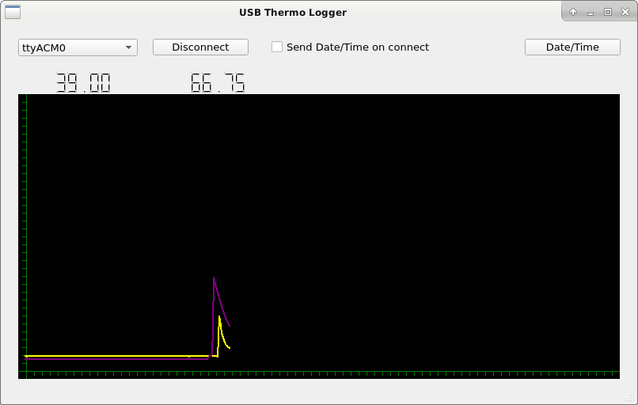

### Sample Python Qt5 USB Thermo logger application

This is a simple PyQt5 application for rendering the returned temperature data from my USB thermocouple converter.

The main window layout is done in Qt 5 designer and can be converted to the modules/MainWindow.py file with:

    pyuic5 designer/main.ui -o modules/MainWindow.py

